# 1. 数据结构和算法

数据结构+算法=程序

## 1. 数据结构概述

### 1.1 概念

数据元素之间的关系

### 1.2 分类

#### 1.2.1 逻辑结构

​	数据元素之间的关系[★★★★★]

1. 集合结构:数据元素除了同属于一个集合外,没有任何关系

   

2. 线性结构:数据元素之间存在一对一的关系

   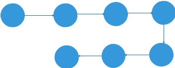

3. 树形结构:数据元素之间存在一对多的层次关系

   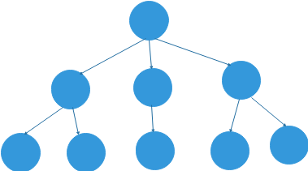

4. 图形结构:数据元素之间存在多对多的关系

   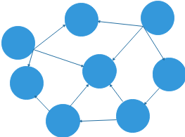

#### 1.2.1 物理结构

数据的逻辑结构在计算机上存储形式,包括内存,硬盘,软盘,光盘等

1. 顺序存储:数据元素存储在地址连续的存储单元里,其数据间的物理关系和逻辑关系是一致的.例如:【数组】的存储

   

2. 链式存储:数据结构存储在任意的存储单元里,这组存储单元可以连续,也可以不连续,数据单元中还存放着指针,指向其关联元素的位置.由于数据之前的关系经常发生变化,所以链式结构这种存储结构更加灵活.

   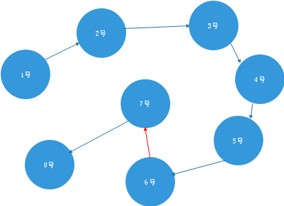

## 2 算法概述

### 2.1 概念

解决特定程序问题的技巧和方式.

针对某个特定问题,解决的算法不唯一,但是掌握一些好的算法很有帮助

### 2.2 特征

* 输入

  算法具有零个或多个输入

* 输出

  算法至少有一个或多个输出

* 有穷

  算法在执行完有限的步骤后自动结束而不会出现无限循环

* 确定性

  算法的每一个步骤都具有确定的含义,不会出现二义性

* 可行性

  算法的每一步都能必须是可行的,每一步执行有限次数完成

### 2.3 要求

* 正确性
* 可读性
* 健壮性
* 时间效率高存储量低

### 2.4 算法的效率

* 事后统计法

  不可取,因为要编写独立的测试方法,麻烦

  不同的测试方法和环境也会导致统计结果的差异

* **事前统计法**

  研究算法随着输入规模的增大其增长量的抽象!

  进行输入测试时,关注主要项,忽略次要项!

### 2.4 算法的时间复杂度

* 概念

​	研究规模n的增大,算法执行次数的**增长率**.
​	执行次数==时间

* 表示法

  大O表示法

* 大O表示法的推算攻略

  1. 用常数1取代加法常数
  2. 只保留最高阶项
  3. 如果最高阶存在且不为1,去掉这个项相乘的常数

* 举例

  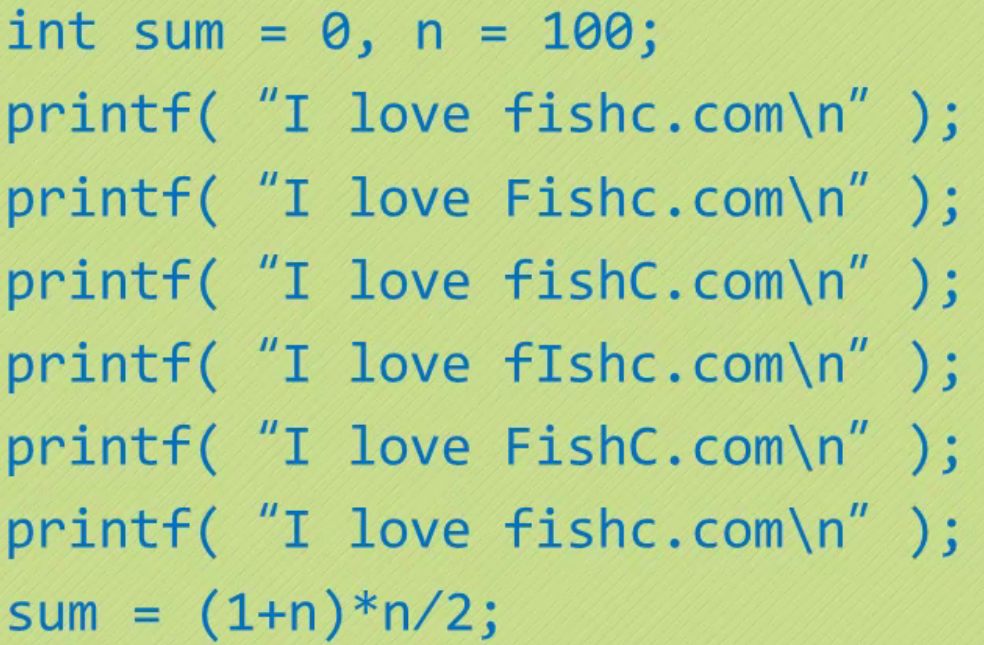算法复杂度:O(1)

---

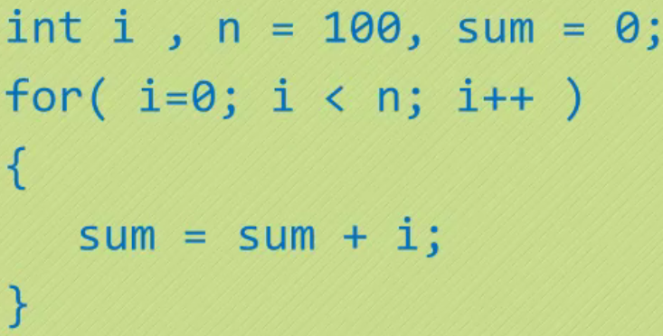

​	算法复杂度:O(n)

------

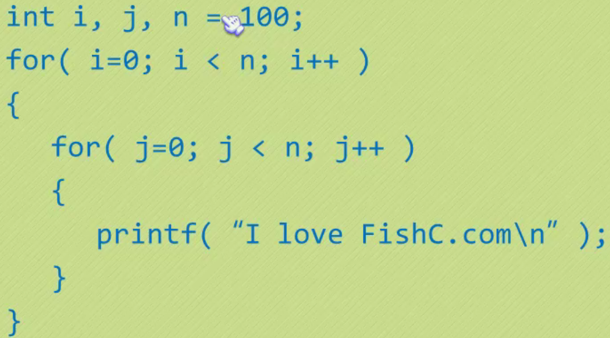

​	算法复杂度:O(n²)

---

* 常见时间复杂度举例

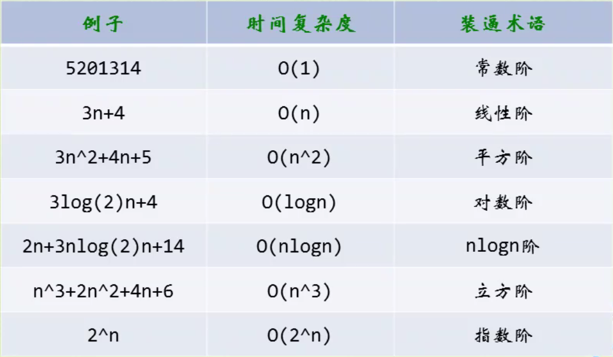

效率

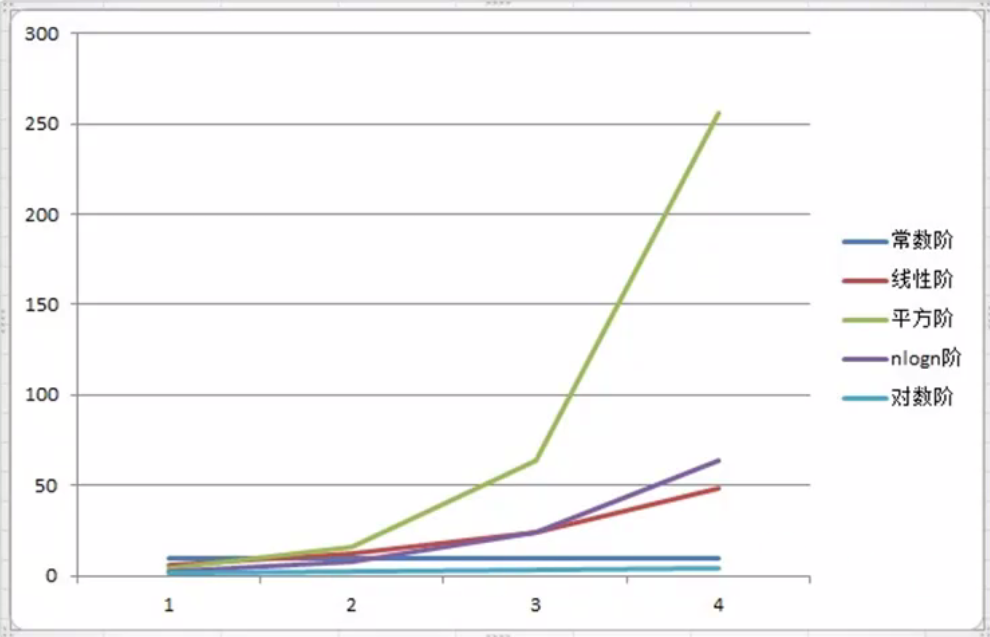

## 3. 线性结构

### 3.1 顺序存储

元素按照逻辑上的先后关系依次存储

* 优点
  1. 无须为额外的逻辑关系而增加额外的存储空间.(物理结构和逻辑结构一致)
  2. 可以快速的存取表中任意位置的元素.(通过下标快速找到指定元素)
* 缺点
  1. 插入和删除元素需要移动大量元素.(需要对其他元素重新定义下标)
  2. 当线性表长度变化较大时,难以确定存储空间的容量.(每次分配连续的空间存储数据)
  3. 容易造成存储空间的碎片

### 3.2 链式存储

每个节点及存储数据也存储下个元素的地址(指针),第一个节点称作头节点,第二个节点称为尾节点.

创建方式有头插法(插入顺序和输入顺序想法)和尾插法(插入顺序和插入顺序一致)

* 优点

  无须预先分配空间,空间可以不连续

  有效的利用存储空间,较少空间碎片化

* 缺点

  元素没有下标,需要循环查找

### 3.3 对比总结

* 分配方式

  * 顺序结构需要一段连续的存储单元依次存储线性表的数据
  * 链式结构用一组任意的存储单元存放线性表关系

* 时间性能

  - 查找
    - 顺序存储O(1)
    - 链式存储O(n)
  - 插入和删除
    - 顺序存储O(n)
    - 链式存储O(1)

* 空间性能

  * 顺序存储结构需要预分配存储空间,元素个数有限制
  * 单链表不需要预分配空间,元素个数无限制

* 总结

  频繁查找用顺序存储结构

  频繁插入和删除用链表存储结构

### 3.4 面试题(腾讯)

Q: 快速查找未知长度单链表的中间节点

回答一:时间复杂度O(n+n/2)=O(3n/2)

 	1. 先遍历链表确定总长度L
 	2. 再从头节点遍历到L/2

回答二:时间复杂度O(n)

 	1. 设置快慢2个指针,快指针的速度是慢指针的2倍
 	2. 快指针和慢指针同时遍历链表
 	3. 当快指针指向尾节点的时候慢指针刚好指向中间节点

### 3.5 常见链表

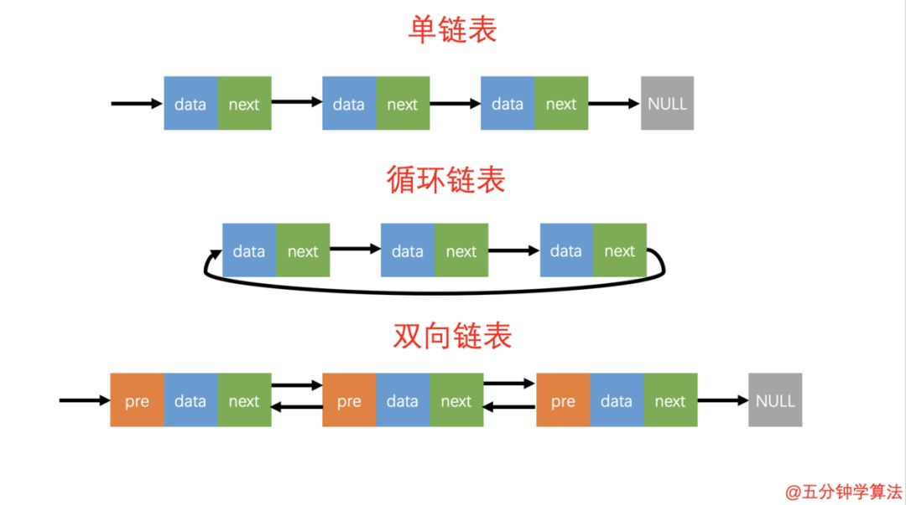

### 3.5 循环链表

### 3.5.1 约瑟夫问题

```java
public static void main(String[] args) {
    System.out.println("程序说明如下：");
    System.out.println("由m个人围成一个首尾相连的圈报数。从第一个人开始，从1开始报数，报到n的人出圈，剩下的人继续从1开始报数，直到所有的人都出圈为止。对于给定的m和n，求出所有人的出圈顺序.");
    //提示输入总人数
    System.out.println("请输入做这个游戏的总人数：");
    Scanner sca = new Scanner(System.in);
    int m = sca.nextInt();
    //提示输入要出圈的数值
    System.out.println("请输入要出圈的数值：");
    int n = sca.nextInt();
    System.out.println("按出圈的次序输出序号：");
    //创建有m个值的数组
    int[] a = new int[m];
    //初始长度，以后出圈一个，长度就减一
    int len = m;
    //给数组赋值
    for (int i = 0; i < a.length; i++)
        a[i] = i + 1;
    //i为元素下表，j代表当前要报的数
    int i = 0;
    int j = 1;
    while (len > 0) {  //如果数组长度减为0,结束游戏
        if (j % n == 0) {//找到要出圈的人，并把圈中人数减一
            System.out.print(a[i % m] + "  ");
            a[i % m] = -1;
            j = 1;//有人出圈后开始从1接着报数
            i++;
            len--;
        } else {//没人出圈，i++,位置往后移动，j++口号加一个，如刚才报的是1，下一个该报2,3,4直到n
            i++;
            j++;

        }
    }
    System.out.println();
    System.out.println("经过了"+i+"次,游戏结束");
}
```

# 2. 数组


## 2.1 初始化

* 初始化给定长度数组,数组元素为默认值0

```java
int[] arr = new int[10];
```

* 初始化数组时赋值

```java
int[] arr = new int[]{1,2,4,3,4,5};
```

## 2.2 基本操作

### 2.2.1 自定义数组

```java
public class MyArray {
    private long[] arr;
    private int elements;   //元素个数

    public MyArray() {
        arr = new long[50];
    }
    
    public MyArray(int len) {
        arr = new long[len];
    }
}
```

### 2.2.2 添加元素

* 末尾追加

```java
public void insert(long value) {
    arr[elements] = value;
    elements++;
}
```

* 有序追加

```java
public void insert(long value) {
    int i;
    for (i = 0; i < elements; i++) {
        if (arr[i] > value) {
            break;
        }
    }
	
    //元素后移
    for (int j = elements; j>i ; j--) {
        arr[j]=arr[j-1];
    }
    arr[i]=value;
    elements++;
}
```


### 2.2.3 检查index是否合法

```java
private void checkIndex(int index) {
    if (index < 0 || index > elements - 1) {
        throw new ArrayIndexOutOfBoundsException();
    }
}
```

### 2.2.4 查找元素

```java
public long get(int index) {
    checkIndex(index);
    return arr[index];
}
```

### 2.2.5 搜索元素

```java
public int search(long value) {
    int index = -1;
    for (int i = 0; i < elements; i++) {
        if (arr[i] == value) {
            index = i;
            break;
        }
    }
    return index;
}
```

### 2.2.6 二分查找

```java
 public int binarySearch(long value) {
     int middle = 0;    
     int begin = 0;
     int last = elements;
     
     int index = -1;

     while (true) {
         //计算中间索引
         middle = (begin + last) / 2;
         //如果中间值刚好等于value,则返回middle
         if (arr[middle] == value) {
             index = middle;
             return index;
         } else if (begin > last) {  //退出条件
             break;
         } else {	//如果中间值大于value,重新查找前半段
             if (arr[middle] > value) {
                 last = middle - 1;
             } else {  //如果中间值小于value,重新查找前半段
                 begin = middle + 1;
             }
         }
     }
     return index;
 }
```

> 注意二分查找的元素必须有序

### 2.2.7 遍历元素

```java
public void display() {
    System.out.print("[ ");
    for (int i = 0; i < elements; i++) {
        System.out.print(arr[i] + " ");
    }
    System.out.print("]");
}
```

### 2.2.8 更新元素

```java
public void update(int index, long value) {
    checkIndex(index);
    arr[index] = value;
}
```

### 2.2.9 删除index的值

```java
 public void delelteByIndex(int index) {
     checkIndex(index);
     //从index开始遍历
     for (int j = index; j < elements; j++) {
         //将index后的值往前移动
         arr[j] = arr[j + 1];
     }
     //arr的数据总数-1
     elements--;
 }
```

### 2.2.10 删除value

```java
public void deleteByValue(long value) {
    //获得value的索引
    int index = search(value);
    //删除index对应的值
    delelteByIndex(index);
}
```

## 2.3 排序

### 2.3.1 冒泡排序


```java
public void bubbleSort(long[] arr) {
    //控制比较次数
    for (int i = 0; i < arr.length - 1; i++) {
        //比较值大小
        for (int j = arr.length - 1; j > i; j--) {
            //如果j小于j-1,向前冒泡
            if (arr[j] < arr[j - 1]) {
                long temp = arr[j];
                arr[j] = arr[j - 1];
                arr[j - 1] = temp;
            }
        }
    }
}
```

### 2.3.2 选择排序


```java
public void selectionSort(long[] arr) {
    //k永远指向最小数
    int k = 0;
    //交换的变量
    long temp = 0;
    for (int i = 0; i < arr.length - 1; i++) {
        //从第一位开始比较
        k = i;
        for (int j = i + 1; j < arr.length; j++) {
            //如果k位置的值大于j的值,k指向j
            if (arr[j] < arr[k]) {
                k = j;
            }
            //经过循环k永远指向最小值
        }
        //交换k和i的值
        temp = arr[i];
        arr[i] = arr[k];
        arr[k] = temp;
    }
}
```

### 2.3.4 插入排序


```java
public void insertSort(long[] arr) {

    for (int i = 1; i < arr.length; i++) {
        long temp = arr[i];
        int j = i - 1;
        while (j >= 0 && arr[j] > temp) {
            arr[j + 1] = arr[j];
            j--;
        }
        arr[j + 1] = temp;
    }
}
```

# 3. 栈


## 3.1 初始化

```java
public class MyStack {
    /**
     * 底层是数组实现
     */
    private long[] arr;
    /**
     * 指向栈顶的指针
     */
    private int top;

    public MyStack() {
        arr = new long[10];
        top = -1;
    }
    
   	public MyStack(int length) {
        arr = new long[length];
        top = -1;
    }
}
```

## 3.2 基本操作

### 3.2.1 插入元素

```java
public void push(long value) {
    arr[++top] = value;
}
```

### 3.2.2 移除元素

```java
public long pop() {
    return arr[top--];
}
```

### 3.2.3 查看元素

```java
public long peek() {
    return arr[top];
}
```

### 3.2.4 判断是否为空

```java
public boolean isEmpty(){
    return top==-1;
}
```

### 3.2.5 是否已满

```java
public boolean isFull(){
    return top==arr.length-1;
}
```

# 4. 队列


## 4.1 初始化

```java
public class MyQueue {

    /**
     * 底层使用数组实现
     */
    private long[] arr;

    /**
     * 元素数量
     */
    private int elements;

    /**
     * 队头
     */
    private int front;

    /**
     * 队尾
     */
    private int end;

    public MyQueue() {
        arr = new long[10];
        elements = 0;
        front = 0;
        end = -1;
    }

    public MyQueue(int maxSize) {
        arr = new long[maxSize];
        elements = 0;
        front = 0;
        end = -1;
    }
}
```

## 4.2 基本操作

### 4.2.1 添加元素

* 非循环添加

```java
public void insert(long value) {
    arr[++end] = value;
    elements++;
}
```

* 循环添加

```java
public void insert(long value) {
    if (end>=arr.length-1) {
        end=-1;
    }else{
        elements++;
    }
    arr[++end] = value;
}
```

### 4.2.2 移除元素

* 非循环移除

```java
public long remove() {
    elements--;
    return arr[front++];
}
```

* 循环移除

```java
public long remove() {
	long value = arr[front++];
	if(front == arr.length) {
		front = 0;
	}
	elements--;
	return value;
}
```

### 4.2.3 查看元素

```java
public long peek() {
    return arr[front];
}
```

### 4.2.4 判断是否为空

```java
public boolean isEmpty() {
    return elements == 0;
}
```

### 4.2.5 判断是否已满

```java
public boolean isFull() {
    return elements == arr.length;
}
```

# 5. 单链表

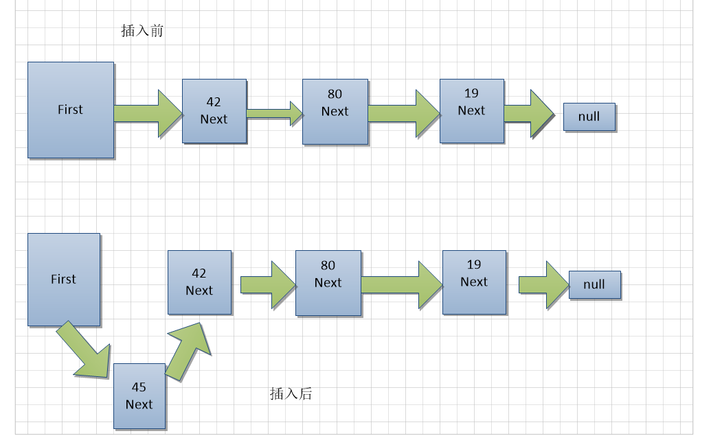

## 5.1 初始化

### 5.1.1 节点

```java
public class Node {
    public long value;
    public Node next;

    public Node(long value) {
        this.value = value;
    }

    public void display() {
        System.out.print(value+" ");
    }

}
```

### 5.1.2 链表对象

```java
public class LinkList {
    private Node first;

    public LinkList() {
        first = null;
    }
}
```

## 5.2 基本操作

### 5.2.1 插入头节点

```java
public void insertFirst(long value) {
    Node node = new Node(value);
    node.next = first;
    first = node;
}
```

### 5.2.2 删除头结点

```java
public Node deleteFirst() {
    Node tmp = first;
    first = tmp.next;
    return tmp;
}
```

### 5.2.3 遍历链表

```java
public void display() {
    Node current = first;
    while (current != null) {
        current.display();
        current = current.next;
    }
    System.out.println();
}
```

### 5.2.4 查找节点

```java
public Node find(long value) {
    Node current = first;
    if (current == null) {
        return null;
    }
    while (current.value != value) {
        if (current == null) {
            return null;
        }
        current = current.next;
    }
    return current;
}
```

### 5.2.5 删除节点

```java
public Node delete(long value) {
    Node current = first;
    Node previous = first;
    //找到值为value的节点
    while (current.value != value) {
        if (current.next == null) {
            return null;
        }
        previous = current;
        current = current.next;
    }
    
    if (current == first) {
        first = first.next;
    } else {
        previous.next = current.next;
    }
    return current;
}
```

# 6. 双端链表

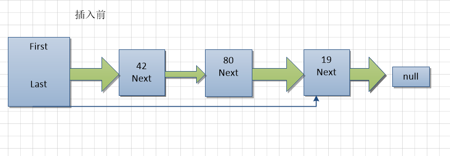

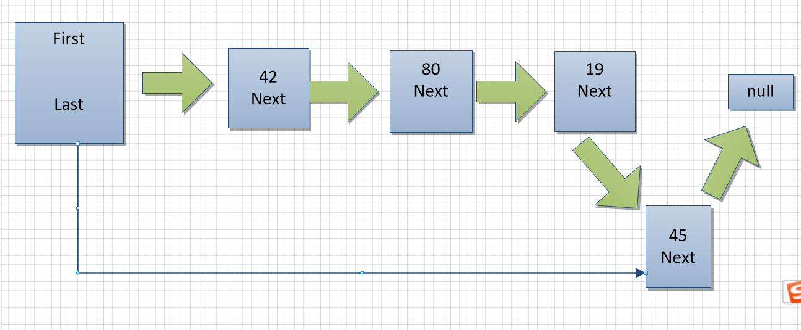

## 6.1 初始化

```java
public class FirstLastLinkList {
    /**
     * 头结点
     */
    private Node first;
    /**
     * 尾节点
     */
    private Node last;

    public FirstLastLinkList() {
        this.first = null;
        this.last = null;
    }
}
```

## 6.2 基本操作

### 6.2.1 插入头结点

```java
public void insertFirst(long value) {
    Node node = new Node(value);
    if (isEmpty()) {
        last = node;
    }
    node.next = first;
    first = node;
}
```

### 6.2.2 插入尾节点

```java
public void insertLast(long value) {
    Node node = new Node(value);
    if (isEmpty()) {
        first = node;
    } else {
        last.next = node;
    }
    last = node;
}
```

### 6.2.3 删除头节点

```java
public Node deleteFirst() {
    Node temp = first;
    if (first.next == null) {
        last = null;
    }
    first = temp.next;
    return temp;
}
```

### 6.2.4 遍历链表

```java
public void display() {
    Node current = first;
    while (current != null) {
        current.display();
        current = current.next;
    }
    System.out.println();
}
```

### 6.2.5 查找节点

```java
public Node find(long value) {
    Node current = first;
    while (current.value != value) {
        if (current.next == null) {
            return null;
        }
        current = current.next;
    }
    return current;
}
```

### 6.2.6 删除节点

```java
public Node delete(long value) {
    Node current = first;
    Node previous = first;
    while (current.value != value) {
        if (current.next == null) {
            return null;
        }
        previous = current;
        current = current.next;
    }

    if (current == first) {
        first = first.next;
    } else {
        previous.next = current.next;
    }

    return current;
}
```

### 6.2.7 判断链表是否为空

```java
public boolean isEmpty() {
    return first == null;
}
```

# 7. 双向链表

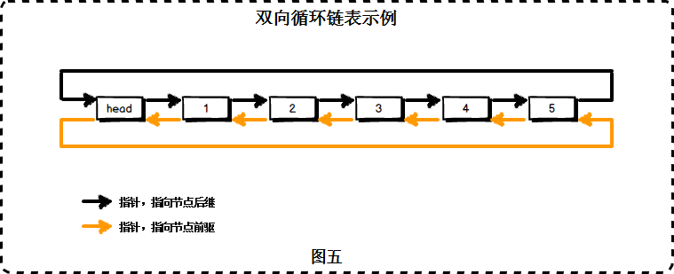

## 7.1 初始化

### 7.1.1 节点

```java
public class DoubleNode {

    public long value;

    public DoubleNode next;
    public DoubleNode previous;

    public DoubleNode(long value) {
        this.value = value;
    }

    public void display() {
        System.out.print(value + " ");
    }
}
```

### 7.1.2 链表对象 

```java
public class DoubleLinkList {

    /**
     * 头结点
     */
    private DoubleNode first;

    /**
     * 尾节点
     */
    private DoubleNode last;

    public DoubleLinkList() {
        first = null;
        last = null;
    }
}
```

## 7.2 基本操作

### 7.2.1 插入头节点

```java
public void insertFirst(long value) {
    DoubleNode node = new DoubleNode(value);
    if (isEmpty()) {
        last = node;
    } else {
        first.previous = node;
    }
    node.next = first;
    first = node;
}
```

### 7.2.2 插入尾节点

```java
public void insertLast(long value) {
    DoubleNode node = new DoubleNode(value);
    if (isEmpty()) {
        first = node;
    } else {
        last.next = node;
        node.previous = last;
    }
    last = node;
}
```

### 7.2.3 删除头结点

```java
public DoubleNode deleteFirst() {
    DoubleNode temp = first;
    if (first.next == null) {
        last = null;
    } else {
        first.next.previous = null;
    }
    first = temp.next;
    return temp;
}
```

### 7.2.4 删除尾节点

```java
public DoubleNode deleteLast() {
    if (first.next == null) {
        first = null;
    } else {
        last.previous.next = null;
    }
    last = last.previous;
    return last;
}
```

### 7.2.5 遍历节点

```java
public void display() {
    DoubleNode current = first;
    while (current != null) {
        current.display();
        current = current.next;
    }
    System.out.println();
}
```

### 7.2.6 删除节点

```java
public DoubleNode delete(long value) {
    DoubleNode current = first;
    while (current.value != value) {
        if (current.next == null) {
            return null;
        }
        current = current.next;
    }
    if (current == first) {
        first = first.next;
    } else {
        current.previous.next = current.next;
    }
    return current;
}
```

### 7.2.7 判断链表是否为空

```java
public boolean isEmpty() {
    return first == null;
}
```

