# 1. 数据结构和算法

数据结构+算法=程序

## 1. 数据结构概述

### 1.1 概念

数据元素之间的关系

### 1.2 分类

#### 1.2.1 逻辑结构

​	数据元素之间的关系[★★★★★]

1. 集合结构:数据元素除了同属于一个集合外,没有任何关系

   

2. 线性结构:数据元素之间存在一对一的关系

   

3. 树形结构:数据元素之间存在一对多的层次关系

   

4. 图形结构:数据元素之间存在多对多的关系

   

#### 1.2.1 物理结构

数据的逻辑结构在计算机上存储形式,包括内存,硬盘,软盘,光盘等

1. 顺序存储:数据元素存储在地址连续的存储单元里,其数据间的物理关系和逻辑关系是一致的.例如:【数组】的存储

   

2. 链式存储:数据结构存储在任意的存储单元里,这组存储单元可以连续,也可以不连续,数据单元中还存放着指针,指向其关联元素的位置.由于数据之前的关系经常发生变化,所以链式结构这种存储结构更加灵活.

   

## 2 算法概述

### 2.1 概念

解决特定程序问题的技巧和方式.

针对某个特定问题,解决的算法不唯一,但是掌握一些好的算法很有帮助

### 2.2 特征

* 输入

  算法具有零个或多个输入

* 输出

  算法至少有一个或多个输出

* 有穷

  算法在执行完有限的步骤后自动结束而不会出现无限循环

* 确定性

  算法的每一个步骤都具有确定的含义,不会出现二义性

* 可行性

  算法的每一步都能必须是可行的,每一步执行有限次数完成

### 2.3 要求

* 正确性
* 可读性
* 健壮性
* 时间效率高存储量低

### 2.4 算法的效率

* 事后统计法

  不可取,因为要编写独立的测试方法,麻烦

  不同的测试方法和环境也会导致统计结果的差异

* **事前统计法**

  研究算法随着输入规模的增大其增长量的抽象!

  进行输入测试时,关注主要项,忽略次要项!

### 2.4 算法的时间复杂度

* 概念

​	研究规模n的增大,算法执行次数的**增长率**.
​	执行次数==时间

* 表示法

  大O表示法

* 大O表示法的推算攻略

  1. 用常数1取代加法常数
  2. 只保留最高阶项
  3. 如果最高阶存在且不为1,去掉这个项相乘的常数

* 举例

  算法复杂度:O(1)

---


​	算法复杂度:O(n)

------


​	算法复杂度:O(n²)

---

* 常见时间复杂度举例


效率


## 3. 线性结构

### 3.1 顺序存储

元素按照逻辑上的先后关系依次存储

* 优点
  1. 无须为额外的逻辑关系而增加额外的存储空间.(物理结构和逻辑结构一致)
  2. 可以快速的存取表中任意位置的元素.(通过下标快速找到指定元素)
* 缺点
  1. 插入和删除元素需要移动大量元素.(需要对其他元素重新定义下标)
  2. 当线性表长度变化较大时,难以确定存储空间的容量.(每次分配连续的空间存储数据)
  3. 容易造成存储空间的碎片

### 3.2 链式存储

每个节点及存储数据也存储下个元素的地址(指针),第一个节点称作头节点,第二个节点称为尾节点.

创建方式有头插法和尾插法

* 优点

  无须预先分配空间,空间可以不连续

  有效的利用存储空间,较少空间碎片化

* 缺点

  元素没有下标,需要循环查找

### 3.3 对比总结

* 分配方式

  * 顺序结构需要一段连续的存储单元依次存储线性表的数据
  * 链式结构用一组任意的存储单元存放线性表关系

* 时间性能

  - 查找
    - 顺序存储O(1)
    - 链式存储O(n)
  - 插入和删除
    - 顺序存储O(n)
    - 链式存储O(1)

* 空间性能

  * 顺序存储结构需要预分配存储空间,元素个数有限制
  * 单链表不需要预分配空间,元素个数无限制

* 总结

  频繁查找用顺序存储结构

  频繁插入和删除用链表存储结构

### 3.4 面试题(腾讯)

Q: 快速查找未知长度单链表的中间节点

回答一:时间复杂度O(n+n/2)=O(3n/2)

 	1. 先遍历链表确定总长度L
 	2. 再从头节点遍历到L/2

回答二:时间复杂度O(n)

 	1. 设置快慢2个指针,快指针的速度是慢指针的2倍
 	2. 快指针和慢指针同时遍历链表
 	3. 当快指针指向尾节点的时候慢指针刚好指向中间节点

### 3.5 常见链表


### 3.5 循环链表

### 3.5.1 约瑟夫问题

```java
public static void main(String[] args) {
    System.out.println("程序说明如下：");
    System.out.println("由m个人围成一个首尾相连的圈报数。从第一个人开始，从1开始报数，报到n的人出圈，剩下的人继续从1开始报数，直到所有的人都出圈为止。对于给定的m和n，求出所有人的出圈顺序.");
    //提示输入总人数
    System.out.println("请输入做这个游戏的总人数：");
    Scanner sca = new Scanner(System.in);
    int m = sca.nextInt();
    //提示输入要出圈的数值
    System.out.println("请输入要出圈的数值：");
    int n = sca.nextInt();
    System.out.println("按出圈的次序输出序号：");
    //创建有m个值的数组
    int[] a = new int[m];
    //初始长度，以后出圈一个，长度就减一
    int len = m;
    //给数组赋值
    for (int i = 0; i < a.length; i++)
        a[i] = i + 1;
    //i为元素下表，j代表当前要报的数
    int i = 0;
    int j = 1;
    while (len > 0) {  //如果数组长度减为0,结束游戏
        if (j % n == 0) {//找到要出圈的人，并把圈中人数减一
            System.out.print(a[i % m] + "  ");
            a[i % m] = -1;
            j = 1;//有人出圈后开始从1接着报数
            i++;
            len--;
        } else {//没人出圈，i++,位置往后移动，j++口号加一个，如刚才报的是1，下一个该报2,3,4直到n
            i++;
            j++;

        }
    }
    System.out.println();
    System.out.println("经过了"+i+"次,游戏结束");
}
```

# 2. 数组

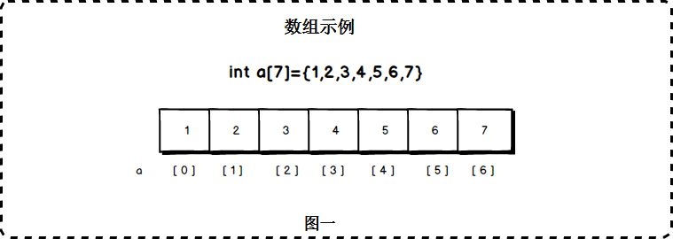

## 2.1 初始化

* 初始化给定长度数组,数组元素为默认值0

```java
int[] arr = new int[10];
```

* 初始化数组时赋值

```java
int[] arr = new int[]{1,2,4,3,4,5};
```

## 2.2 基本操作

### 2.2.1 自定义数组

```java
public class MyArray {
    private long[] arr;
    private int elements;   //元素个数

    public MyArray() {
        arr = new long[50];
    }
    
    public MyArray(int len) {
        arr = new long[len];
    }
}
```

### 2.2.2 添加元素

* 末尾追加

```java
public void insert(long value) {
    arr[elements] = value;
    elements++;
}
```

* 有序追加

```java
public void insert(long value) {
    int i;
    for (i = 0; i < elements; i++) {
        if (arr[i] > value) {
            break;
        }
    }
	
    //元素后移
    for (int j = elements; j>i ; j--) {
        arr[j]=arr[j-1];
    }
    arr[i]=value;
    elements++;
}
```


### 2.2.3 检查index是否合法

```java
private void checkIndex(int index) {
    if (index < 0 || index > elements - 1) {
        throw new ArrayIndexOutOfBoundsException();
    }
}
```

### 2.2.4 查找元素

```java
public long get(int index) {
    checkIndex(index);
    return arr[index];
}
```

### 2.2.5 搜索元素

```java
public int search(long value) {
    int index = -1;
    for (int i = 0; i < elements; i++) {
        if (arr[i] == value) {
            index = i;
            break;
        }
    }
    return index;
}
```

### 2.2.6 二分查找

```java
 public int binarySearch(long value) {
     int middle = 0;    
     int begin = 0;
     int last = elements;
     
     int index = -1;

     while (true) {
         //计算中间索引
         middle = (begin + last) / 2;
         //如果中间值刚好等于value,则返回middle
         if (arr[middle] == value) {
             index = middle;
             return index;
         } else if (begin > last) {  //退出条件
             break;
         } else {	//如果中间值大于value,重新查找前半段
             if (arr[middle] > value) {
                 last = middle - 1;
             } else {  //如果中间值小于value,重新查找前半段
                 begin = middle + 1;
             }
         }
     }
     return index;
 }
```

> 注意二分查找的元素必须有序

### 2.2.7 遍历元素

```java
public void display() {
    System.out.print("[ ");
    for (int i = 0; i < elements; i++) {
        System.out.print(arr[i] + " ");
    }
    System.out.print("]");
}
```

### 2.2.8 更新元素

```java
public void update(int index, long value) {
    checkIndex(index);
    arr[index] = value;
}
```

### 2.2.9 删除index的值

```java
 public void delelteByIndex(int index) {
     checkIndex(index);
     //从index开始遍历
     for (int j = index; j < elements; j++) {
         //将index后的值往前移动
         arr[j] = arr[j + 1];
     }
     //arr的数据总数-1
     elements--;
 }
```

### 2.2.10 删除value

```java
public void deleteByValue(long value) {
    //获得value的索引
    int index = search(value);
    //删除index对应的值
    delelteByIndex(index);
}
```

## 2.3 排序

### 2.3.1 冒泡排序


```java
public void bubbleSort(long[] arr) {
    //控制比较次数
    for (int i = 0; i < arr.length - 1; i++) {
        //比较值大小
        for (int j = arr.length - 1; j > i; j--) {
            //如果j小于j-1,向前冒泡
            if (arr[j] < arr[j - 1]) {
                long temp = arr[j];
                arr[j] = arr[j - 1];
                arr[j - 1] = temp;
            }
        }
    }
}
```

### 2.3.2 选择排序


```java
public void selectionSort(long[] arr) {
    //k永远指向最小数
    int k = 0;
    //交换的变量
    long temp = 0;
    for (int i = 0; i < arr.length - 1; i++) {
        //从第一位开始比较
        k = i;
        for (int j = i + 1; j < arr.length; j++) {
            //如果k位置的值大于j的值,k指向j
            if (arr[j] < arr[k]) {
                k = j;
            }
            //经过循环k永远指向最小值
        }
        //交换k和i的值
        temp = arr[i];
        arr[i] = arr[k];
        arr[k] = temp;
    }
}
```

### 2.3.4 插入排序


```java
public void insertSort(long[] arr) {

    for (int i = 1; i < arr.length; i++) {
        long temp = arr[i];
        int j = i - 1;
        while (j >= 0 && arr[j] > temp) {
            arr[j + 1] = arr[j];
            j--;
        }
        arr[j + 1] = temp;
    }
}
```

### 2.3.5 希尔排序

相比插入排序,希尔排序在移动元素的次数更少


```java
public void shellSort(long[] arr) {
    //初始化一个间隔
    int h = 1;
    while (h < arr.length / 3) {
        h = h * 3 + 1;
    }
    while (h > 0) {
        long temp = 0;
        for (int i = h; i < arr.length; i++) {
            temp = arr[i];
            int j = i;
            while (j > h - 1 && arr[j - h] >= temp) {
                arr[j] = arr[j - h];
                j -= h;
            }
            arr[j] = temp;
        }
        h = (h - 1) / 3;
    }
}
```

### 2.3.6 快速排序


```java
/**
 * 划分数组
 */
public int partition(long[] arr, int left, int right, long point) {
    int leftPtr = left - 1;
    int rightPtr = right;

    while (true) {
        while (leftPtr < rightPtr && arr[++leftPtr] < point) ;
        while (rightPtr > leftPtr && arr[--rightPtr] > point) ;

        if (leftPtr >= rightPtr) {
            break;
        } else {
            long temp = arr[leftPtr];
            arr[leftPtr] = arr[rightPtr];
            arr[rightPtr] = temp;
        }
    }
    long temp = arr[leftPtr];
    arr[leftPtr] = arr[right];
    arr[right] = temp;
    return leftPtr;
}

 /**
  * 快速排序
  *
  * @param arr
  * @param left
  * @param right
  */
 public void quickSort(long[] arr, int left, int right) {
     if (right - left <= 0) {
         return;
     } else {
         //设置比较关键字
         long point = arr[right];
         //获得切入点,同时对数组进行划分
         int partition = partition(arr, left, right, point);
         //对左边的子数组进行快速排序
         quickSort(arr, left, partition - 1);
         //对右边的子数组进行快速排序
         quickSort(arr, partition + 1, right);
     }
 }
```


# 3. 栈


## 3.1 初始化

```java
public class MyStack {
    /**
     * 底层是数组实现
     */
    private long[] arr;
    /**
     * 指向栈顶的指针
     */
    private int top;

    public MyStack() {
        arr = new long[10];
        top = -1;
    }
    
   	public MyStack(int length) {
        arr = new long[length];
        top = -1;
    }
}
```

## 3.2 基本操作

### 3.2.1 插入元素

```java
public void push(long value) {
    arr[++top] = value;
}
```

### 3.2.2 移除元素

```java
public long pop() {
    return arr[top--];
}
```

### 3.2.3 查看元素

```java
public long peek() {
    return arr[top];
}
```

### 3.2.4 判断是否为空

```java
public boolean isEmpty(){
    return top==-1;
}
```

### 3.2.5 是否已满

```java
public boolean isFull(){
    return top==arr.length-1;
}
```

# 4. 队列

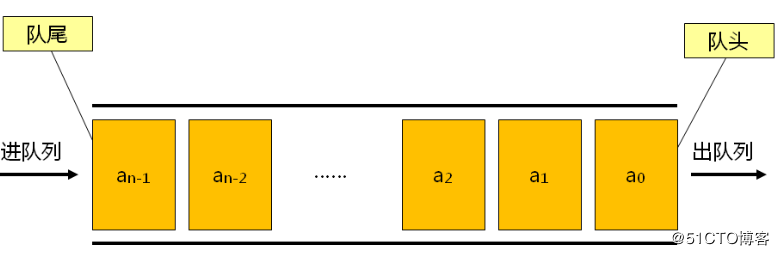

## 4.1 初始化

```java
public class MyQueue {

    /**
     * 底层使用数组实现
     */
    private long[] arr;

    /**
     * 元素数量
     */
    private int elements;

    /**
     * 队头
     */
    private int front;

    /**
     * 队尾
     */
    private int end;

    public MyQueue() {
        arr = new long[10];
        elements = 0;
        front = 0;
        end = -1;
    }

    public MyQueue(int maxSize) {
        arr = new long[maxSize];
        elements = 0;
        front = 0;
        end = -1;
    }
}
```

## 4.2 基本操作

### 4.2.1 添加元素

* 非循环添加

```java
public void insert(long value) {
    arr[++end] = value;
    elements++;
}
```

* 循环添加

```java
public void insert(long value) {
    if (end>=arr.length-1) {
        end=-1;
    }else{
        elements++;
    }
    arr[++end] = value;
}
```

### 4.2.2 移除元素

* 非循环移除

```java
public long remove() {
    elements--;
    return arr[front++];
}
```

* 循环移除

```java
public long remove() {
	long value = arr[front++];
	if(front == arr.length) {
		front = 0;
	}
	elements--;
	return value;
}
```

### 4.2.3 查看元素

```java
public long peek() {
    return arr[front];
}
```

### 4.2.4 判断是否为空

```java
public boolean isEmpty() {
    return elements == 0;
}
```

### 4.2.5 判断是否已满

```java
public boolean isFull() {
    return elements == arr.length;
}
```

# 5. 单链表


## 5.1 初始化

### 5.1.1 节点

```java
public class Node {
    public long value;
    public Node next;

    public Node(long value) {
        this.value = value;
    }

    public void display() {
        System.out.print(value+" ");
    }

}
```

### 5.1.2 链表对象

```java
public class LinkList {
    private Node first;

    public LinkList() {
        first = null;
    }
}
```

## 5.2 基本操作

### 5.2.1 插入头节点

```java
public void insertFirst(long value) {
    Node node = new Node(value);
    node.next = first;
    first = node;
}
```

### 5.2.2 删除头结点

```java
public Node deleteFirst() {
    Node tmp = first;
    first = tmp.next;
    return tmp;
}
```

### 5.2.3 遍历链表

```java
public void display() {
    Node current = first;
    while (current != null) {
        current.display();
        current = current.next;
    }
    System.out.println();
}
```

### 5.2.4 查找节点

```java
public Node find(long value) {
    Node current = first;
    if (current == null) {
        return null;
    }
    while (current.value != value) {
        if (current == null) {
            return null;
        }
        current = current.next;
    }
    return current;
}
```

### 5.2.5 删除节点

```java
public Node delete(long value) {
    Node current = first;
    Node previous = first;
    //找到值为value的节点
    while (current.value != value) {
        if (current.next == null) {
            return null;
        }
        previous = current;
        current = current.next;
    }
    
    if (current == first) {
        first = first.next;
    } else {
        previous.next = current.next;
    }
    return current;
}
```

# 6. 双端链表


## 6.1 初始化

```java
public class FirstLastLinkList {
    /**
     * 头结点
     */
    private Node first;
    /**
     * 尾节点
     */
    private Node last;

    public FirstLastLinkList() {
        this.first = null;
        this.last = null;
    }
}
```

## 6.2 基本操作

### 6.2.1 插入头结点

```java
public void insertFirst(long value) {
    Node node = new Node(value);
    if (isEmpty()) {
        last = node;
    }
    node.next = first;
    first = node;
}
```

### 6.2.2 插入尾节点

```java
public void insertLast(long value) {
    Node node = new Node(value);
    if (isEmpty()) {
        first = node;
    } else {
        last.next = node;
    }
    last = node;
}
```

### 6.2.3 删除头节点

```java
public Node deleteFirst() {
    Node temp = first;
    if (first.next == null) {
        last = null;
    }
    first = temp.next;
    return temp;
}
```

### 6.2.4 遍历链表

```java
public void display() {
    Node current = first;
    while (current != null) {
        current.display();
        current = current.next;
    }
    System.out.println();
}
```

### 6.2.5 查找节点

```java
public Node find(long value) {
    Node current = first;
    while (current.value != value) {
        if (current.next == null) {
            return null;
        }
        current = current.next;
    }
    return current;
}
```

### 6.2.6 删除节点

```java
public Node delete(long value) {
    Node current = first;
    Node previous = first;
    while (current.value != value) {
        if (current.next == null) {
            return null;
        }
        previous = current;
        current = current.next;
    }

    if (current == first) {
        first = first.next;
    } else {
        previous.next = current.next;
    }

    return current;
}
```

### 6.2.7 判断链表是否为空

```java
public boolean isEmpty() {
    return first == null;
}
```

# 7. 双向链表


## 7.1 初始化

### 7.1.1 节点

```java
public class DoubleNode {

    public long value;

    public DoubleNode next;
    public DoubleNode previous;

    public DoubleNode(long value) {
        this.value = value;
    }

    public void display() {
        System.out.print(value + " ");
    }
}
```

### 7.1.2 链表对象 

```java
public class DoubleLinkList {

    /**
     * 头结点
     */
    private DoubleNode first;

    /**
     * 尾节点
     */
    private DoubleNode last;

    public DoubleLinkList() {
        first = null;
        last = null;
    }
}
```

## 7.2 基本操作

### 7.2.1 插入头节点

```java
public void insertFirst(long value) {
    DoubleNode node = new DoubleNode(value);
    if (isEmpty()) {
        last = node;
    } else {
        first.previous = node;
    }
    node.next = first;
    first = node;
}
```

### 7.2.2 插入尾节点

```java
public void insertLast(long value) {
    DoubleNode node = new DoubleNode(value);
    if (isEmpty()) {
        first = node;
    } else {
        last.next = node;
        node.previous = last;
    }
    last = node;
}
```

### 7.2.3 删除头结点

```java
public DoubleNode deleteFirst() {
    DoubleNode temp = first;
    if (first.next == null) {
        last = null;
    } else {
        first.next.previous = null;
    }
    first = temp.next;
    return temp;
}
```

### 7.2.4 删除尾节点

```java
public DoubleNode deleteLast() {
    if (first.next == null) {
        first = null;
    } else {
        last.previous.next = null;
    }
    last = last.previous;
    return last;
}
```

### 7.2.5 遍历节点

```java
public void display() {
    DoubleNode current = first;
    while (current != null) {
        current.display();
        current = current.next;
    }
    System.out.println();
}
```

### 7.2.6 删除节点

```java
public DoubleNode delete(long value) {
    DoubleNode current = first;
    while (current.value != value) {
        if (current.next == null) {
            return null;
        }
        current = current.next;
    }
    if (current == first) {
        first = first.next;
    } else {
        current.previous.next = current.next;
    }
    return current;
}
```

### 7.2.7 判断链表是否为空

```java
public boolean isEmpty() {
    return first == null;
}
```

# 8. 递归

## 8.1 三角数列

规则:第n项的值=n-1项的值+n

>  项数:  1,2,3,4,5,6
>
>  值:      1,3,6,10,15,21

### 8.1.1 非递归实现

```java
public int getNumber(int n) {
    int total = 0;
    while (n > 0) {
        total = total + n;
        n--;
    }
    return total;
}
```

### 8.1.2 递归实现

```java
public int getNumberByRecursion(int n) {
    if (n == 1) {
        return 1;
    } else {
        return n + getNumberByRecursion(n - 1);
    }
}
```

## 8.2 斐波那契数列

规则:第1项为0,第2项为1,第3项为1...第n项为(n-1)+(n-2)

>  项数:  1,2,3,4,5,6
>
>  值:      0,1,1,2,3,5

```java
public int getNumber(int n) {
    if (n == 1) {
        return 0;
    } else if (n == 2) {
        return 1;
    } else {
        return getNumber(n - 1) + getNumber(n - 2);
    }
}
```

## 8.3 汉诺塔


思路分析:

 	1. 将TopN-1个盘子从A移动到B
 	2. 将TopN的盘子从A移动到C
 	3. 将TopN-1个盘子从B移动到C

```java
public void doTower(int topN, char from, char inter, char to) {
    if (topN == 1) {
        System.out.println("盘子1,从" + from + "塔座到" + to + "塔座");
    } else {
        //1.将topN-1的盘子从from移动到inter
        doTower(topN - 1, from, to, inter);
        //2.将topN的盘子从from移动到to
        System.out.println("盘子" + topN + ",从" + from + "塔座到" + to + "塔座");
        //3.将topN-1的盘子从inter移动到to
        doTower(topN - 1, inter, from, to);
    }
}
```

[汉诺塔在线游戏](http://www.4399.com/flash/676_1.htm)

# 9. 树

概念:树一种抽象数据类型,用来模拟具有树状结构性质的数据集合.

1. 每个节点有零个或多个子节点
2. 没有父节点的称为根节点
3. 每个非跟节点有且只有一个父节点
4. 除了根节点外,每个子节点可以分为多个不相交的子树

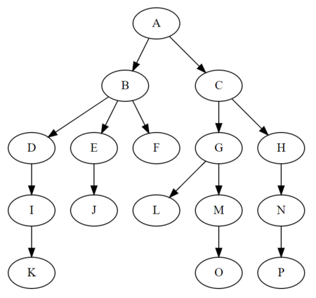

## 9.1 二叉树(**有序二叉树**)

概念:每个节点最多只有2个子节点,分别为左子节点和右子节点

特点:

1. 左子树上的所有节点的值均小于根节点的值
2. 右子书上的所有节点的值均大于根节点的值
3. 任意节点的左,右子树也分别为二叉树
4. 没有键值相等的节点


### 9.1.1 初始化

#### 9.1.1.1 节点

```java
public class Node {
    /**
     * 数据项
     */
    public long data;

    /**
     * 数据项
     */
    public String sDate;

    /**
     * 左节点
     */
    public Node leftChild;
    /**
     * 右节点
     */
    public Node rightChild;

    /**
     * 构造方法
     *
     * @param data
     * @param sDate
     */
    public Node(long data, String sDate) {
        this.data = data;
        this.sDate = sDate;
    }
}
```

#### 9.1.1.2 二叉树

```java
public class OrderedBinaryTree {

    /**
     * 根节点
     */
    private Node root;
}
```

### 9.1.2 基本操作

#### 9.1.2.1 插入节点

```java
public void insert(long value, String sValue) {
    //封装节点
    Node newNode = new Node(value, sValue);
    //引用当前节点
    Node current = root;
    //应用父节点
    Node parent;
    //如果root为null,第一次插入的时候
    if (root == null) {
        root = newNode;
        return;
    } else {    //非第一次插入
        //遍历树
        while (true) {
            //父节点指向当前节点
            parent = current;
            if (current.data > value) {
                //如果当前指向的节点数据比插入的数据大,则走向左子树
                current = current.leftChild;
                if (current == null) {
                    parent.leftChild = newNode;
                    return;
                }
            } else {
                //如果当前指向的节点的数据比插入数据小,则走向右子树
                current = current.rightChild;
                if (current == null) {
                    parent.rightChild = newNode;
                    return;
                }
            }
        }
    }
}
```

#### 9.1.2.2 查找节点

```java
public Node find(long value) {
    //应用当前节点,从根节点开始
    Node current = root;
    //循环,只要查找值不等于当前节点的数据项就一致查找
    while (current.data != value) {
        //进行比较,如果当前节点的值大于查找值,则走向左子树
        if (current.data > value) {
            current = current.leftChild;
        } else {    //如果当前节点的值小于查找值,则走向右子树
            current = current.rightChild;
        }
        //如果查不到,返回null
        if (current == null) {
            return null;
        }
    }
    return current;
}
```

#### 9.1.2.3 遍历节点

* 前序遍历

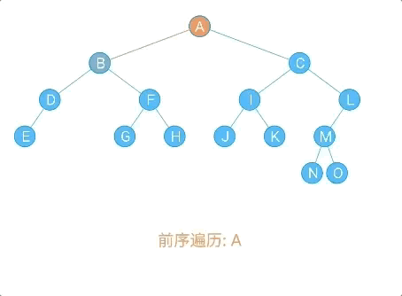

```java
/**
 * 前序遍历:
 * (1)访问根节点
 * (2)先序遍历左子树
 * (3)先序遍历右子树
 *
 * @param localNode
 */
public void frontOrder(Node localNode) {
    if (localNode != null) {
        //访问根节点
        System.out.println(localNode.data + "," + localNode.sData);
        //前序遍历左子树
        frontOrder(localNode.leftChild);
        //前序遍历右子树
        frontOrder(localNode.rightChild);
    }
}
```

* 中序遍历

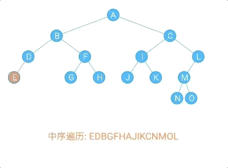

```java
/**
 * 中序遍历
 * (1)中序遍历左子树
 * (2)访问根节点
 * (3)中序遍历右子树
 *
 * @param localNode
 */
public void inOrder(Node localNode) {
    if (localNode != null) {
        //中序遍历左子树
        inOrder(localNode.leftChild);
        //访问根节点
        System.out.println(localNode.data + "," + localNode.sData);
        //中序遍历右子树
        inOrder(localNode.rightChild);
    }
}
```

* 后续遍历

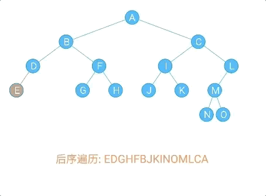

```java
/**
 * 后续遍历
 * (1)后序遍历左子树
 * (2)后序遍历右子树
 * (3)访问根节点
 *
 * @param localNode
 */
public void afterOrder(Node localNode) {
    if (localNode != null) {
        //后续遍历左子树
        afterOrder(localNode.leftChild);
        //后续遍历右子树
        afterOrder(localNode.rightChild);
        //访问根节点
        System.out.println(localNode.data + "," + localNode.sData);
    }
}
```

#### 9.1.2.3 删除节点

* 删除叶子节点:直接删除该节点，再修改其父节点的指针（注意分是根节点和不是根节点）

  eg:删除72

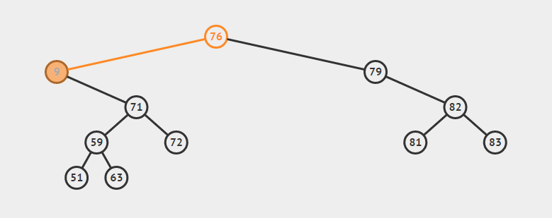

* 删除单支节点:让p的子树与p的父亲节点相连，再删除p即可；（注意分是根节点和不是根节点两种情况）

  eg:删除79

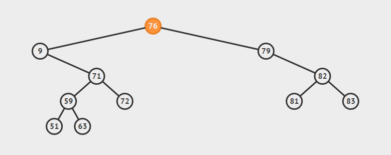

* 删除双支节点:首先找到p的后继y，因为y一定没有左子树，所以可以删除y，并让y的父亲节点成为y的右子树的父亲节点，并用y的值代替p的值

  eg:删除9

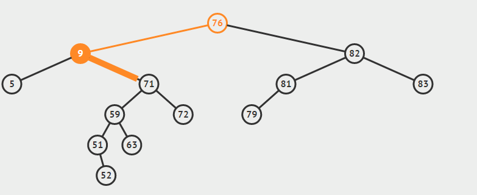

```java
/**
 * 删除节点
 *
 * @param value
 */
public boolean delete(long value) {
    //引用当前节点,从根节点开始
    Node current = root;
    //应用当前节点的父节点
    Node parent = root;
    //当前是否为左节点标记
    boolean isLeftChild = true;
    //查找节点
    while (current.data != value) {
        parent = current;
        if (current.data > value) {
            current = current.leftChild;
        } else {
            current = current.rightChild;
            isLeftChild = false;
        }

        if (current == null) {
            return false;
        }
    }
    //如果是叶子节点
    if (current.leftChild == null && current.rightChild == null) {
        if (current == root) {
            root = null;
        } else if (isLeftChild) {
            parent.leftChild = null;
        } else {
            parent.rightChild = null;
        }
    } else if (current.rightChild == null) {    //单支节点,左节点为空
        if (current == root) {
            root = root.leftChild;
        } else if (isLeftChild) {
            parent.leftChild = current.leftChild;
        } else {
            parent.rightChild = current.rightChild;
        }

    } else if (current.leftChild == null) {     //单支节点,左节点为空
        if (current == root) {
            root = root.rightChild;
        } else if (isLeftChild) {
            parent.leftChild = current.leftChild;
        } else {
            parent.rightChild = current.rightChild;
        }
    } else {  //如果是双支节点
        //1.查找后继节点
        //2.删除后继结点
        //3.让后继结点的父节点称为其右子树的父节点
        //4.让后继节点替代待删除的节点
        Node successor = getSuccessor(current);
        if(current == root) {
            root = successor;
        } else if(isLeftChild) {
            parent.leftChild = successor;
        } else{
            parent.rightChild = successor;
        }
        successor.leftChild = current.leftChild;
    }
    return true;
}

/**
 * 查找后继节点
 *
 * @param delNode
 * @return
 */
private Node getSuccessor(Node delNode) {
    //引用后继节点
    Node successor = delNode;
    //应用后继节点父节点
    Node successorParent = delNode;
    //引用当前节点
    Node current = delNode.rightChild;

    //走向左子树,查找后继节点
    while (current!=null){
        successorParent = successor;
        successor = current;
        current = current.leftChild;
    }

    //判断是否找到
    if(successor!=delNode.rightChild){
        successorParent.leftChild = successor.rightChild;
        successor.rightChild = delNode.rightChild;
    }
    return successor;
}
```

## 9.2 红黑树

如果节点的值有序,那么有序二叉树就会是如下链表形状

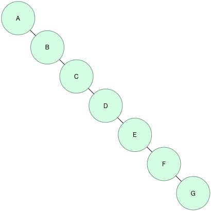

如果当值有序依然要建立树形结构的关系,就要使用红黑树,也称自平衡的二叉查找树

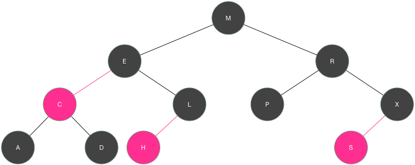

插入节点的过程

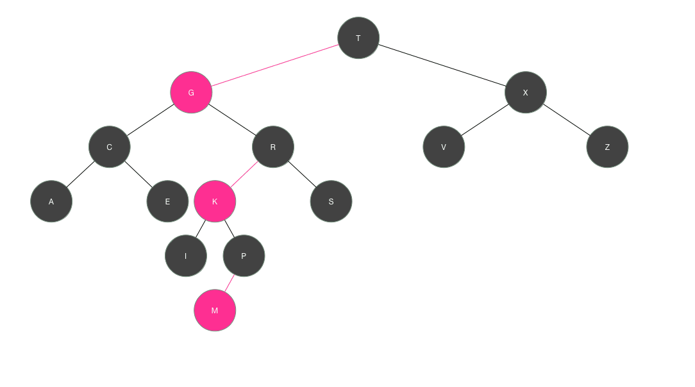

[参考链接](https://luodichen.com/blog/tag/%E7%BA%A2%E9%BB%91%E6%A0%91/)

# 10. 哈希

根据键（Key）而直接访问在内存存储位置的[数据结构

## 10.1 初始化

* 实体类

```java
public class Info {
    private String key;
    private String name;
}
```

* Hash表

```java
public class HashTable {

    private Info[] arr;

    public HashTable() {
        arr = new Info[100];
    }

    public HashTable(int maxSize) {
        arr = new Info[maxSize];
    }
}
```

## 10.2 基本操作

### 10.2.1 计算key的Hash值

```java
public int hashCode(String key) {
    /**
     * 这种方式进行转换,如果key='abc' || 'acb' || 'cba'
     * 那么这三个不同的key会计算出相同的hashCode值,造成数据的被覆盖!
     */
	// int hashVal = 0;
	// for (int i = key.length() - 1; i >= 0; i--) {
	//     int letter = key.charAt(i) - 96;
	//     hashVal += letter;
	// }
	// return hashVal;

    BigInteger hashVal = new BigInteger("0");
    BigInteger pow27 = new BigInteger("1");
    for (int i = key.length() - 1; i >= 0; i--) {
        int letter = key.charAt(i) - 96;
        BigInteger letterB = new BigInteger(String.valueOf(letter));
        hashVal = hashVal.add(letterB.multiply(pow27));
        pow27 = pow27.multiply(new BigInteger(String.valueOf(27)));
    }
    return hashVal.mod(new BigInteger((String.valueOf(arr.length)))).intValue();
}
```

### 10.2.2 插入数据

```java
public void insert(Info info) {
    arr[hashCode(info.getKey())] = info;
}
```

### 10.2.3 查找数据

```java
public Info find(String key) {
    return arr[hashCode(key)];
}
```

## 10.3 解决冲突

无论设置的存储区域（n）有多大，当需要存储的数据大于 n 时，那么必然会存在哈希值相同的情况。这就是所谓的散列冲突

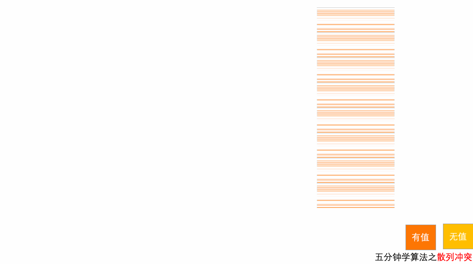

### 10.3.1 开放地址法

当添加数据发生冲突时,寻找一个空位,并将数据插入.

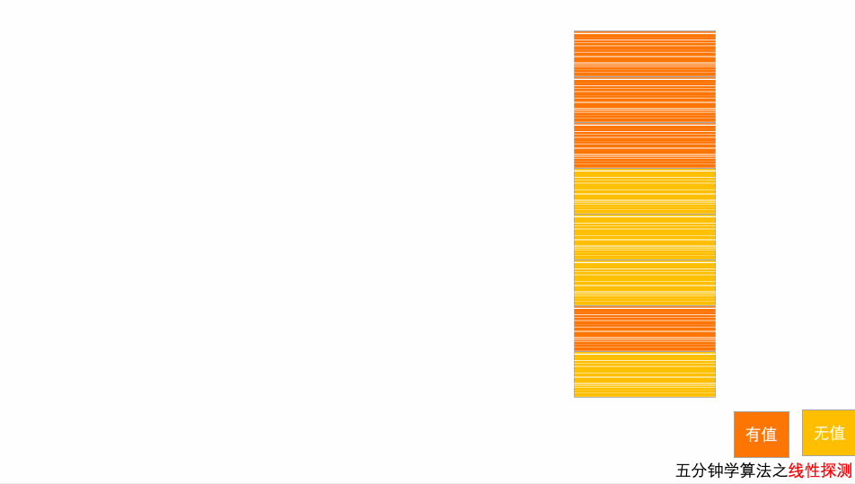

* 添加元素

```java
public void insert(Info info) {
    //获得关键字的Hash值
    int hashCode = hashCode(info.getKey());
    //如果当前的位置已经占用,并且值不为空
    while (arr[hashCode] != null && arr[hashCode].getName() != null) {
        //进行递加
        ++hashCode;
        //循环
        hashCode %= arr.length;
    }
    arr[hashCode] = info;
}
```

* 查找元素

```java
public Info find(String key) {
    int hashCode = hashCode(key);
    while (arr[hashCode] != null) {
        if (arr[hashCode].getKey().equals(key)) {
            return arr[hashCode];
        }
        ++hashCode;
        hashCode %= arr.length;
    }
    return null;
}
```

* 删除元素

```java
public Info delete(String key) {
    int hashCode = hashCode(key);
    while (arr[hashCode] != null) {
        if (arr[hashCode].getKey().equals(key)) {
            Info info = arr[hashCode];
            info.setName(null);
            return info;
        }
    }
    return null;
}
```

### 10.3.2 链表法

每个位置对应一条链表，所有散列值相同的元素都放到相同位置对应的链表中

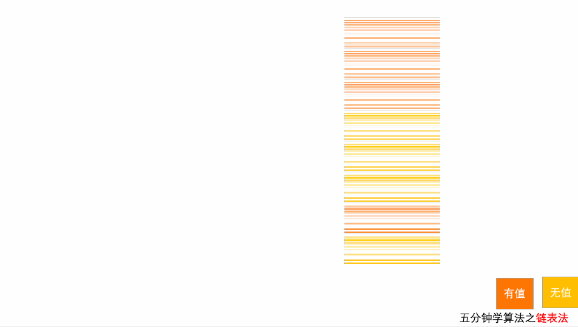

* 节点

```java
public class Node {
    /**
     * 数据域
     */
    public Info info;
    /**
     * 指针域
     */
    public Node next;

    public Node(Info info) {
        this.info = info;
    }
}
```

* 链表

```java
public class LinkList {

    /**
     * 头结点指针
     */
    private Node first;

    public LinkList() {
        first = null;
    }

    /**
     * 在头结点后插入节点
     *
     * @param info
     */
    public void insertFirst(Info info) {
        Node node = new Node(info);
        node.next = first;
        first = node;
    }

    /**
     * 删除节点
     *
     * @return
     */
    public Node deleteFirst() {
        Node tmp = first;
        first = tmp.next;
        return tmp;
    }

    /**
     * 查找方法
     *
     * @param key
     * @return
     */
    public Node find(String key) {
        Node current = first;
        while (!key.equals(current.info.getKey())) {
            if (current.next == null) {
                return null;
            }
            current = first.next;
        }
        return current;
    }

    /**
     * 删除节点
     *
     * @param key
     * @return
     */
    public Node delete(String key) {
        Node current = first;
        Node previous = first;
        while (!key.equals(current.info.getKey())) {
            if (current.next == null) {
                return null;
            }
            previous = current;
            current = current.next;
        }

        if (current == first) {
            first = first.next;
        } else {
            previous.next = current.next;
        }
        return current;

    }

}
```

* 初始化HashTable

```java
public class HashTable {

    public LinkList[] arr;

    public HashTable() {
        arr = new LinkList[100];
    }

    public HashTable(int maxSize) {
        arr = new LinkList[maxSize];
    }
}
```

* 添加元素

```java
public void insert(Info info) {
    String key = info.getKey();
    int hashCode = hashCode(key);
    if (arr[hashCode] == null) {
        arr[hashCode] = new LinkList();
    }
    arr[hashCode].insertFirst(info);
}
```

* 查找元素

```java
public Info find(String key) {
    int hashCode = hashCode(key);
    return arr[hashCode].find(key).info;
}
```

* 删除元素

```java
public Info delete(String key) {
    int hashCode = hashCode(key);
    return arr[hashCode].delete(key).info;
}
```

# 11. 图

## 11.1 基本概念

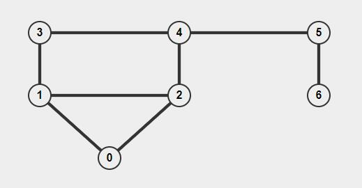

**图:**是一种和树想像的数据结构,通常有一个固定的形状.

**临接:**如果两个顶点被同一条边相连,就称这连个顶点是临接的

**路径:**路径是从一个顶点到另一个顶点经过的边的序列

**连通图和非连通图:**至少有一条路径可以连接所有的点,那么这个图就是联通图,否则是非联通图

**有向图:**有向图的边是有方向的.如只能从A到B,不能从B到A

**无向图:**无向图的边是无方向的.可以从A到B,也可以从B到A

**带权图:**在有些图中,边被赋予一个权值,权值是数字.它可以代表两个顶点的物理距离或者是一个顶点到另一个顶点的时间等等.

## 11.2 初始化

* 顶点类

```java
public class Vertex {

    public char label;

    public boolean isVisited;

    public Vertex(char label) {
        this.label = label;
    }
}
```

* 图

```java
public class Graph {

    /**
     * 顶点数组
     */
    private Vertex[] vertexList;

    /**
     * 临接矩阵
     */
    private int[][] adjMat;

    /**
     * 顶点的最大数量
     */
    private int maxSize = 20;

    /**
     * 当前顶点数量
     */
    private int nVertex;


    public Graph() {
        vertexList = new Vertex[maxSize];
        adjMat = new int[maxSize][maxSize];
        for (int i = 0; i < maxSize; i++) {
            for (int j = 0; j < maxSize; j++) {
                adjMat[i][j] = 0;
            }
        }
        nVertex = 0;
    }

    /**
     * 添加顶点
     *
     * @param label
     */
    public void addVertex(char label) {
        vertexList[nVertex++] = new Vertex(label);
    }

    /**
     * 添加边
     *
     * @param start
     * @param end
     */
    public void addEdge(int start, int end) {
        adjMat[start][end] = 1;
        adjMat[end][start] = 1;
    }
    
}
```

* 创建图

```java
Graph graph = new Graph();
graph.addVertex('A');
graph.addVertex('B');
graph.addVertex('C');
//0代表A,1代表B,2代表C
graph.addEdge(0, 1);	
graph.addEdge(0, 2);
graph.addEdge(1, 2);
```

## 11.3 搜索

### 11.3.1 广度搜索


#### 11.3.1.1 实现步骤

1. 访问临接的未访问过的顶点,标记该顶点,并放入队列中
2. 如果不能执行步骤1,就从队列中取出一个顶点
3. 当不能执行步骤1和2时,就完成了搜索

#### 11.3.1.2 代码实现

* 创建队列

```java
/**
 * 队列
 */
private MyQueue queue;


public Graph() {
    vertexList = new Vertex[maxSize];
    adjMat = new int[maxSize][maxSize];
    for (int i = 0; i < maxSize; i++) {
        for (int j = 0; j < maxSize; j++) {
            adjMat[i][j] = 0;
        }
    }
    nVertex = 0;
    stack = new MyStack();
    queue = new MyQueue();
}
```

* 广度遍历

```java
public void wfs() {
    //首先访问0号顶点
    vertexList[0].isVisited = true;
    //显示该顶点
    displayVertex(0);
    //放入队列中
    queue.insert(0);
    //遍历
    while (!queue.isEmpty()) {
        int v = getAdjUnVisitedVertex((int) queue.peek());
        if (v == -1) {
            queue.remove();
        } else {
            vertexList[v].isVisited = true;
            displayVertex(v);
            queue.insert(v);
        }
    }

    //搜索完毕后,将节点的状态改为已经访问
    for (int i = 0; i < nVertex; i++) {
        vertexList[i].isVisited = true;
    }
}
```


### 11.3.2 深度搜索


#### 11.3.2.1 实现步骤

1. 访问临接的未访问过的顶点,标记该顶点,并放入栈中
2. 如果不能执行步骤1,且栈不为空,就从栈中弹出一个顶点
3. 当不能指定步骤1和步骤2 ,就完成了整个搜索过程

#### 11.3.2.2 代码实现

* 创建栈

```java
/**
 * 栈
 */
private MyStack stack;


public Graph() {
    vertexList = new Vertex[maxSize];
    adjMat = new int[maxSize][maxSize];
    for (int i = 0; i < maxSize; i++) {
        for (int j = 0; j < maxSize; j++) {
            adjMat[i][j] = 0;
        }
    }
    nVertex = 0;
    stack = new MyStack();
}
```

* 遍历

```java
public void dfs() {
    //首先访问0号顶点
    vertexList[0].isVisited = true;
    //显示该顶点
    displayVertex(0);
    //压入栈中
    stack.push(0);
    //遍历
    while (!stack.isEmpty()) {
        //获得一个未访问过的临接点
        int v = getAdjUnVisitedVertex((int) stack.peek());
        //如果已经访问过,则弹栈
        if (v == -1) {
            stack.pop();
        } else {   //未访问过,则标记,并压入栈中
            vertexList[v].isVisited = true;
            displayVertex(v);
            stack.push(v);
        }
    }

    //搜索完毕后,将节点的状态改为已经访问
    for (int i = 0; i < nVertex; i++) {
        vertexList[i].isVisited = true;
    }
}
```

## 11.4 最小生成树

连接每个顶点最少的连线.最小生成树的边数总比顶点数少1.

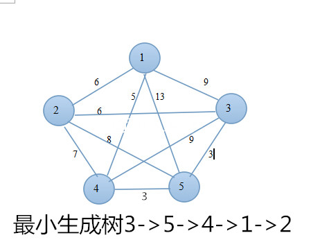

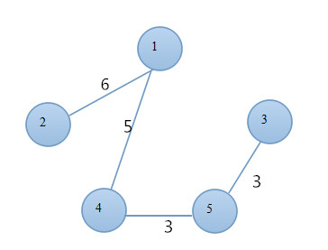

```java
public void mst() {
    //首先访问0号节点
    vertexList[0].isVisited = true;
    //压入栈中
    stack.push(0);
    while (!stack.isEmpty()) {
        int currentVertex = (int) stack.peek();
        //获得一个未访问过的临接点
        int v = getAdjUnVisitedVertex(currentVertex);
        if (v == -1) {
            //弹出一个顶点
            stack.pop();
        } else {
            vertexList[v].isVisited = true;
            stack.push(v);
            displayVertex(currentVertex);
            System.out.print("-");
            displayVertex(v);
            System.out.print(" ");
        }
    }
}
```

# 12 布隆过滤器

## 12.1 应用场景

- 字处理软件中，需要检查一个英语单词是否拼写正确
- 在 FBI，一个嫌疑人的名字是否已经在嫌疑名单上
- 在网络爬虫里，一个网址是否被访问过
- yahoo, gmail等邮箱垃圾邮件过滤功能

> 以上这些场景有个共同的问题：如何查看一个东西是否在有大量数据的池子里面。

通常的做法有如下几种思路：

- 数组
- 链表
- 树、平衡二叉树、Trie
- Map (红黑树)
- 哈希表

> 上面这几种数据结构配合一些搜索算法是可以解决数据量不大的问题的，如果当集合里面的数据量非常大的时候，就会有问题。比如：
> 有500万条记录甚至1亿条记录？这个时候常规的数据结构的问题就凸显出来了。数组、链表、树等数据结构会存储元素的内容，一旦数据量过大，消耗的内存也会呈现线性增长，最终达到瓶颈。哈希表查询效率可以达到O(1)。但是哈希表需要消耗的内存依然很高。使用哈希表存储一亿 个垃圾 email 地址的消耗？哈希表的做法：首先，哈希函数将一个email地址映射成8字节信息指纹；考虑到哈希表存储效率通常小于50%（哈希冲突）；因此消耗的内存：8 * 2 * 1亿 字节 = 1.6G 内存，普通计算机是无法提供如此大的内存。这个时候，布隆过滤器（Bloom Filter）就应运而生。

## 12.2 哈希函数

在继续介绍布隆过滤器的原理时，先讲解下关于哈希函数的预备知识。

哈希函数的概念是：将任意大小的数据转换成特定大小的数据的函数，转换后的数据称为哈希值或哈希编码。下面是一幅示意图


可以明显的看到，原始数据经过哈希函数的映射后称为了一个个的哈希编码，数据得到压缩。哈希函数是实现哈希表和布隆过滤器的基础。

## 12.3 布隆过滤器

### 12.3.1 背景介绍

- 巴顿.布隆于一九七零年提出
- 一个很长的二进制向量 （位数组）
- 一系列随机函数 (哈希)
- 空间效率和查询效率高
- 不会漏判，但是有一定的误判率（哈希表是精确匹配

### 12.3.1 原理

布隆过滤器（Bloom Filter）的核心实现是一个超大的位数组和几个哈希函数。假设位数组的长度为m，哈希函数的个数为k

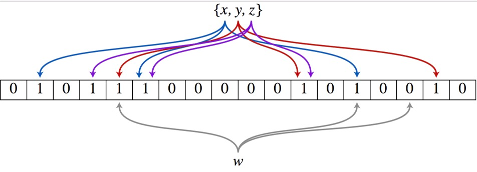

> 以上图为例，具体的操作流程：假设集合里面有3个元素{x, y, z}，哈希函数的个数为3。首先将位数组进行初始化，将里面每个位都设置位0。对于集合里面的每一个元素，将元素依次通过3个哈希函数进行映射，每次映射都会产生一个哈希值，这个值对应位数组上面的一个点，然后将位数组对应的位置标记为1。查询W元素是否存在集合中的时候，同样的方法将W通过哈希映射到位数组上的3个点。如果3个点的其中有一个点不为1，则可以判断该元素一定不存在集合中。反之，如果3个点都为1，则该元素可能存在集合中。注意：此处不能判断该元素是否一定存在集合中，可能存在一定的误判率。可以从图中可以看到：假设某个元素通过映射对应下标为4，5，6这3个点。虽然这3个点都为1，但是很明显这3个点是不同元素经过哈希得到的位置，因此这种情况说明元素虽然不在集合中，也可能对应的都是1，这是误判率存在的原因。

### 12.3.3 添加元素

- 将要添加的元素给k个哈希函数
- 得到对应于位数组上的k个位置
- 将这k个位置设为1

### 12.3.4 查询元素

- 将要查询的元素给k个哈希函数
- 得到对应于位数组上的k个位置
- 如果k个位置有一个为0，则肯定不在集合中
- 如果k个位置全部为1，则可能在集合中

### 12.3.5 代码实现

```java
import java.util.BitSet;

public class SimpleBloomFilter {

    private static final int DEFAULT_SIZE = 2 << 24;
    private static final int[] seeds = new int[] {7, 11, 13, 31, 37, 61,};

    private BitSet bits = new BitSet(DEFAULT_SIZE);
    private SimpleHash[] func = new SimpleHash[seeds.length];

    public static void main(String[] args) {
        String value = " stone2083@yahoo.cn ";
        SimpleBloomFilter filter = new SimpleBloomFilter();
        System.out.println(filter.contains(value));
        filter.add(value);
        System.out.println(filter.contains(value));
    }

    public SimpleBloomFilter() {
        for (int i = 0; i < seeds.length; i++) {
            func[i] = new SimpleHash(DEFAULT_SIZE, seeds[i]);
        }
    }

    public void add(String value) {
        for (SimpleHash f : func) {
            bits.set(f.hash(value), true);
        }
    }

    public boolean contains(String value) {
        if (value == null) {
            return false;
        }
        boolean ret = true;
        for (SimpleHash f : func) {
            ret = ret && bits.get(f.hash(value));
        }
        return ret;
    }

    public static class SimpleHash {

        private int cap;
        private int seed;

        public SimpleHash(int cap, int seed) {
            this.cap = cap;
            this.seed = seed;
        }

        public int hash(String value) {
            int result = 0;
            int len = value.length();
            for (int i = 0; i < len; i++) {
                result = seed * result + value.charAt(i);
            }
            return (cap - 1) & result;
        }

    }
}
```

